If this document renders weirdly, it’s because it uses [GitLab flavored markdown](https://docs.gitlab.com/user/markdown/#table-of-contents) and some elements might not be supported by your viewer.

[TOC]

# 🚧 v1.3 - Q2 2025

## Features

### Miscellaneous features

- Indexing: jobs now give more meaningful error messages in case there are files missing for runs. Instead of just `input file list empty - maybe the run has the wrong files entered?`, you now also get `I've searched the following patterns for files:  ...` ([\#462](https://gitlab.desy.de/cfel-sc/amarcord-parent/amarcord-serial/-/issues/462))
- Indexing: in a similar vein to the above, you now get a better error message when the geometry file is missing; this previously complained about `cannot resolve geometry hash`, which is true, but unhelpful. Now you see `cannot find the given geometry file ..., check that it exists and is readable`
- Indexing: now, also an error in `list_events` will be reported properly
- SLURM REST interface: you now need to explicitly specify an `api-version` parameter (since the version changes frequently and it shouldn't be hard-coded) ([\#467](https://gitlab.desy.de/cfel-sc/amarcord-parent/amarcord-serial/-/merge_requests/455))
- Indexing results: failed results are now hidden, and can be shown with a check-box ([\#468](https://gitlab.desy.de/cfel-sc/amarcord-parent/amarcord-serial/-/issues/468))
- Files are now compressed if they are too big. There is a parameter in the API to force this on or off, too ([\#429](https://gitlab.desy.de/cfel-sc/amarcord-parent/amarcord-serial/-/issues/429)). Nothing changes for the normal user.
- The "All runs" table now has a date columns for "started" and "stopped". Previously we only displayed the time, which was useless in multi-day beamtimes ([\#466](https://gitlab.desy.de/cfel-sc/amarcord-parent/amarcord-serial/-/issues/466)):
<figure>
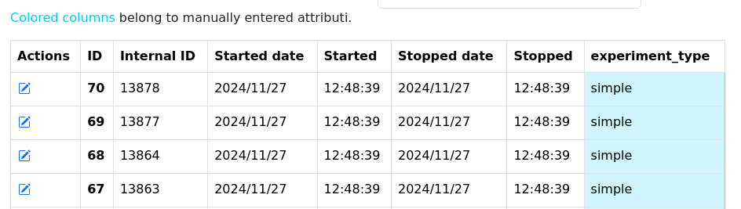{width=944 height=267px}
</figure>

## Fixes

- Run Overview: The browser tab title now changes even if the tab is in the background ([\#460](https://gitlab.desy.de/cfel-sc/amarcord-parent/amarcord-serial/-/issues/460))
- Merging: Error output from partialator was omitted from job log ([\#461](https://gitlab.desy.de/cfel-sc/amarcord-parent/amarcord-serial/-/issues/461))
- Export: Fixed error message if there were chemicals with files in it.

## Development changes

- Upgraded the pydantic serialization/deserialization framework to version 2 now, resulting in increased performance ([\#463](https://gitlab.desy.de/cfel-sc/amarcord-parent/amarcord-serial/-/issues/463))
- Remove `python-dateutil` and `pytz`, both superseded by Python 3.9's [ZoneInfo](https://docs.python.org/3.9/library/zoneinfo.html) (and `python-dateutil` had a Python 3.12 [deprecation warning](https://github.com/dateutil/dateutil/issues/1284)). In the light of that, rework all of the frontend and backend to have a consistent time zone usage. This doesn't affect the user and is documented in the official documentation. ([\#465](https://gitlab.desy.de/cfel-sc/amarcord-parent/amarcord-serial/-/issues/465))

# v1.2 - Q1 2025

## Features
### Excel import ([\#249](https://gitlab.desy.de/cfel-sc/amarcord-parent/amarcord-serial/-/issues/249), [\#406](https://gitlab.desy.de/cfel-sc/amarcord-parent/amarcord-serial/-/issues/406), [\#407](https://gitlab.desy.de/cfel-sc/amarcord-parent/amarcord-serial/-/issues/407), [\#410](https://gitlab.desy.de/cfel-sc/amarcord-parent/amarcord-serial/-/issues/410), [\#413](https://gitlab.desy.de/cfel-sc/amarcord-parent/amarcord-serial/-/issues/413), [\#414](https://gitlab.desy.de/cfel-sc/amarcord-parent/amarcord-serial/-/issues/414), [\#415](https://gitlab.desy.de/cfel-sc/amarcord-parent/amarcord-serial/-/issues/415), [\#416](https://gitlab.desy.de/cfel-sc/amarcord-parent/amarcord-serial/-/issues/416), [\#428](https://gitlab.desy.de/cfel-sc/amarcord-parent/amarcord-serial/-/issues/428), [\#440](https://gitlab.desy.de/cfel-sc/amarcord-parent/amarcord-serial/-/issues/440), [\#446](https://gitlab.desy.de/cfel-sc/amarcord-parent/amarcord-serial/-/issues/446))

It is now possible to import run metadata from an Excel spreadsheet. The feature is available from the menu via “Admin → Import”:

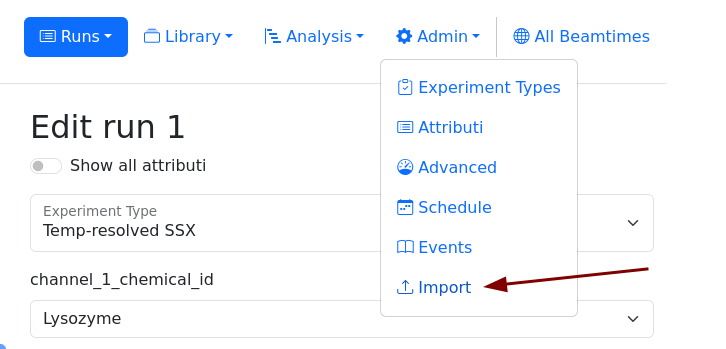{width=726 height=349px}

Via a wizard, you will be guided through the discrete steps in order to import your metadata, from creating Attributi, to Experiment Types, to the runs themselves. You will be able to download a template .xlsx file to fill out.

<figure>
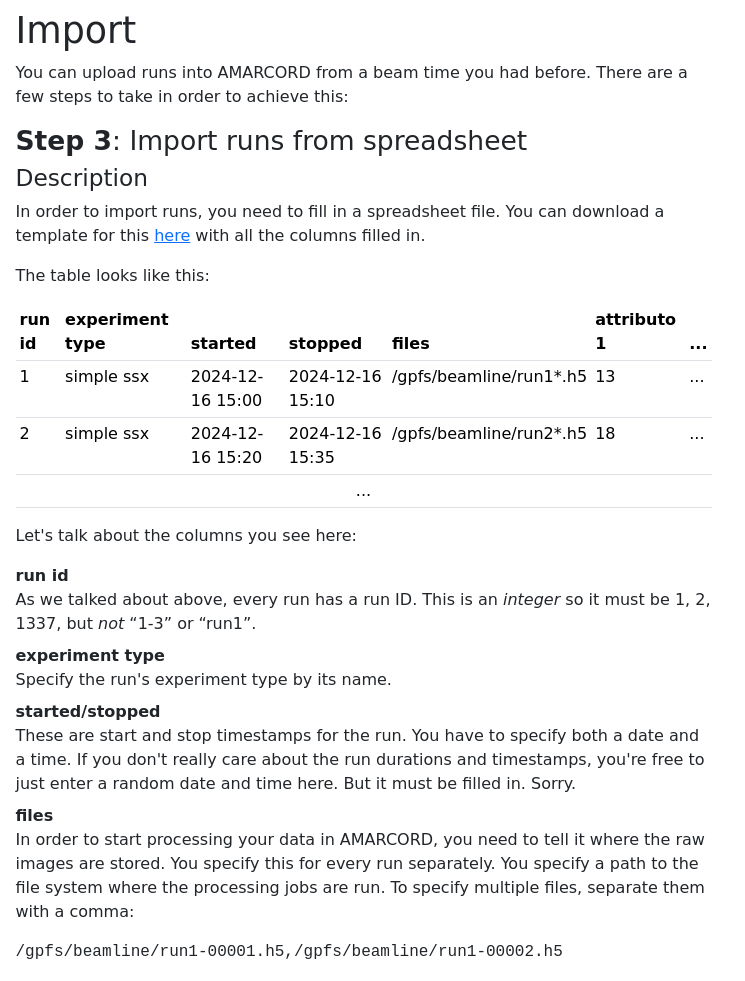{width=388 height=510px}
<figcaption>The last step of the import: actually uploading the Excel file, with a description of the columns needed and possible.</figcaption>
</figure>
<figure>
{width=388 height=510px}
<figcaption>The last step of the import: actually uploading the Excel file, with a description of the columns needed and possible.</figcaption>
</figure>

The import can be _simulated_ first, to see which Data Sets would be generated, and how many runs. There are also a lot of sanity checks in place to guarantee you’re importing something correctly.
### Data Set view: Indexing parameter differences ([\#439](https://gitlab.desy.de/cfel-sc/amarcord-parent/amarcord-serial/-/issues/439))

When you’re trying to figure out the best parameters to index your frames, you often play around a lot. Previously, AMARCORD did show you the command-line arguments (as well as the unit cell and geometry file path) for every indexing job _individually_. If you were interested in finding out what _changed_ between results, you were out of luck.

Now, the Data Set view shows which parameters have changed since the previous indexing result:

<figure>
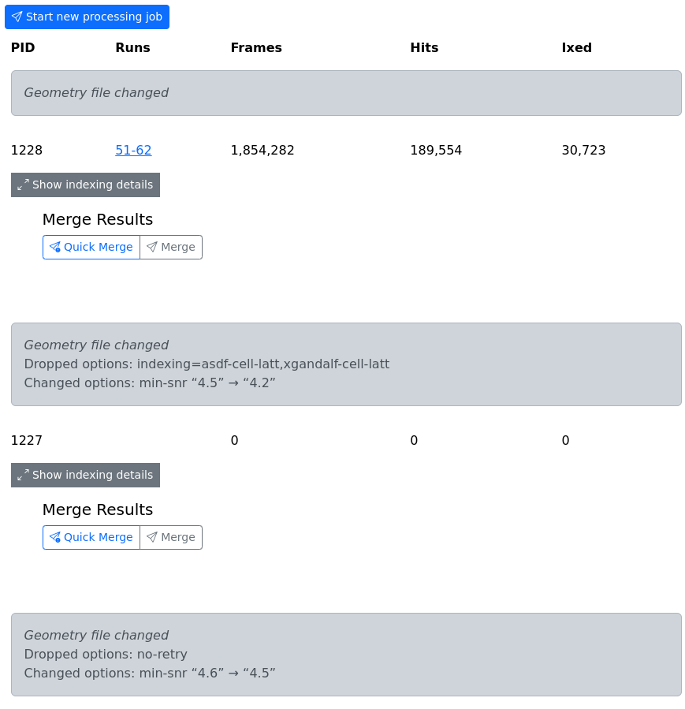{width=493 height=510px}
<figcaption>A Data Set with some indexing results; you can better see what parameters changed now.</figcaption>
</figure>

As you can see, for the geometry file, we only get “changed” for now. In the future we might be more specific.

### Cell description edit interface ([\#431](https://gitlab.desy.de/cfel-sc/amarcord-parent/amarcord-serial/-/issues/431),  [\#435](https://gitlab.desy.de/cfel-sc/amarcord-parent/amarcord-serial/-/issues/435), [\#452](https://gitlab.desy.de/cfel-sc/amarcord-parent/amarcord-serial/-/issues/452))

Editing a unit cell (UC) description was a purely text-based affair previously. You had an input field and had to fill it correctly. There was no feedback on whether what you typed was actually a valid unit cell!

This has changed, and we now have a UI widget that still has the text capabilities (which is nice for copy&pasting a UC) but now also has a view with separate input fields:

<figure>
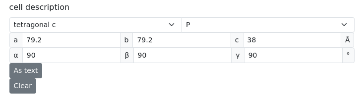{width=732 height=199px}
<figcaption>The “structured” editing view (it will be in one single line if your screen is big enough)</figcaption>
</figure>

This widget also has feedback on validity of UCs, see here:

<figure>
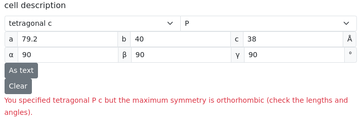{width=719 height=251px}
<figcaption>Entering an “invalid” UC description (b changed to 40, making this not tetragonal)</figcaption>
</figure>

### Special Attributo: “space group” 🪄 ([\#430](https://gitlab.desy.de/cfel-sc/amarcord-parent/amarcord-serial/-/issues/430))

You can now create a string Attributo called “space group” for chemicals, which will be used to write the space group into the .mtz file after merging. Previously, the point group was chosen, which was mostly wrong and lead to complications when trying to refine the MTZ file generated by AMARCORD.

You can also specify the space group explicitly when merging.

<figure>
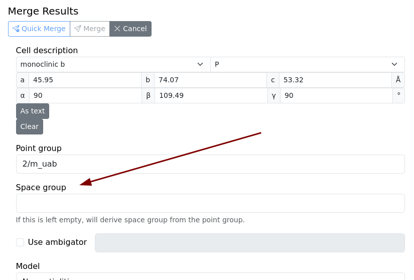{width=755 height=510px}
<figcaption>The merge details show you the space group that will be used for merging and which will be taken from the chemical if entered there.</figcaption>
</figure>

### Attributi edit: Separate into tabs

There are _chemical_ Attributi and _run_ attributi. Previously, they were shown in one table under “Admin → Attributi”. Now this is separated into tabs, hopefully reducing confusion:

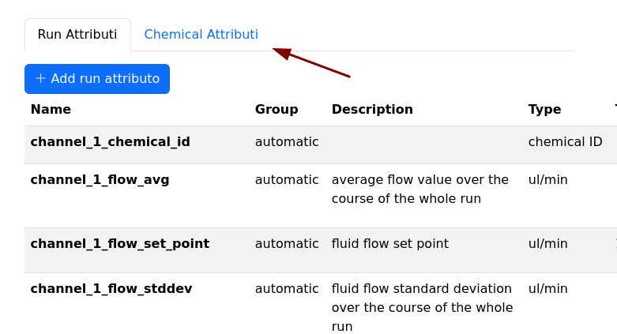{width=781 height=423px}

### Data set view: link to the runs table ([\#408](https://gitlab.desy.de/cfel-sc/amarcord-parent/amarcord-serial/-/issues/408))

In the data set view, you can now not only see which runs belong to a data set, but also get a limit runs table for just these runs:

<figure>
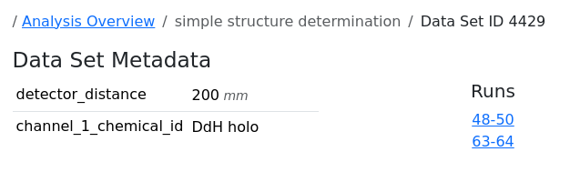{width=626 height=189px}
<figcaption>Excerpt from the Data Set overview, where the runs are actually clickable now, and will filter the runs table with runs 48-50 and 63-64 so you can inspect more details.</figcaption>
</figure>

### Runs: make files editable ([\#403](https://gitlab.desy.de/cfel-sc/amarcord-parent/amarcord-serial/-/issues/403))

Runs always had, in addition to storing Attributi, _files_ attached to them (think HDF5 files). These would be used as the basis offline indexing. These files can now be _edited_ in the runs table (press the “Edit run” icon, then scroll down):

<figure>
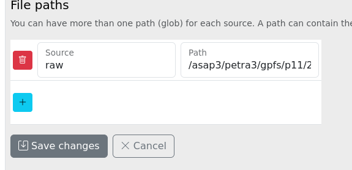{width=575 height=278px}
<figcaption>A little hard to see (hard to make a screenshot that fits on smaller displays), but this is a cropped view of the runs table, while editing a single run. You can see a single file “glob” attached to it, pointing to the HDF5 files for this run.</figcaption>
</figure>

### Beamtimes: Analysis output path ([\#402](https://gitlab.desy.de/cfel-sc/amarcord-parent/amarcord-serial/-/issues/402), [\#443](https://gitlab.desy.de/cfel-sc/amarcord-parent/amarcord-serial/-/issues/443))

Previously, indexing and merge results were stored at a fixed path, so the experimenter couldn’t decide where to put their files. This is now configurable in the beam time properties:

<figure>
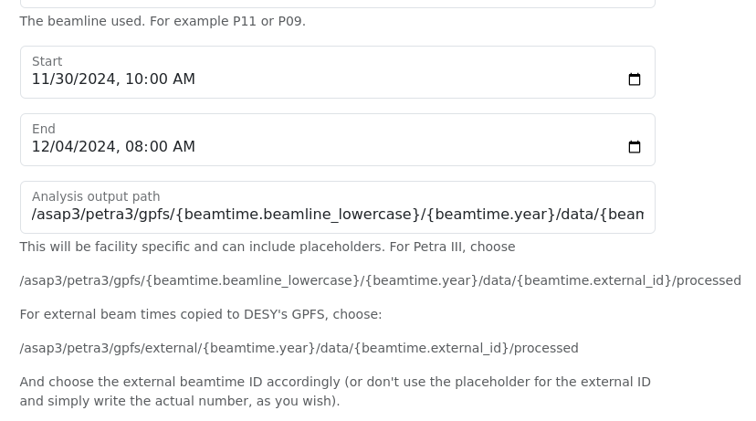{width=828 height=461px}
<figcaption>Cropped view of the “Edit” interface for a single beam time. At the very bottom you can set the output path now.</figcaption>
</figure>

There are placeholders so you don’t have to worry about entering the beamline or the beamtime ID twice.

### Merging: Ambigator support ([\#253](https://gitlab.desy.de/cfel-sc/amarcord-parent/amarcord-serial/-/issues/253))

When merging your indexing results into an .mtz file, you can now specify an [ambigator](https://www.desy.de/~twhite/crystfel/manual-ambigator.html) command-line:

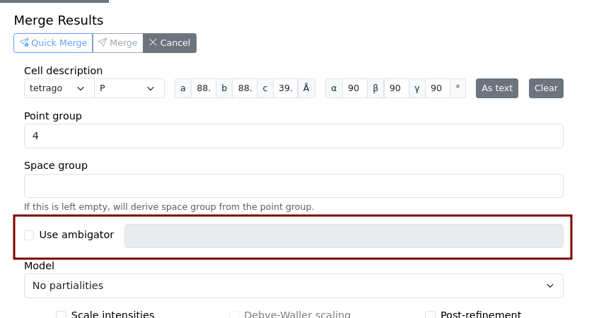{width=840 width=450px}

This currently does not have a nice UI yet, and you cannot pass _all_ ambigator arguments. For simplicity’s sake, only the _long_ arguments are supported. This means you cannot specify `-y point-group` but have to use `--symmetry point-group`.

If you do, then the “Details” view contains the fg-graph plot and can tell you more about the outcome:

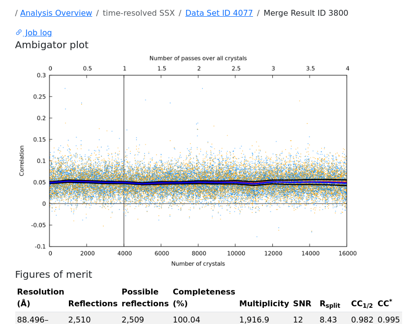{width=650 height=510px}

### Event log: Date filter ([\#456](https://gitlab.desy.de/cfel-sc/amarcord-parent/amarcord-serial/-/issues/456))
The under-used “Events” view (accessible via the menu “Admin” → “Event Log”) now has a date filter just like the run table:

<figure>
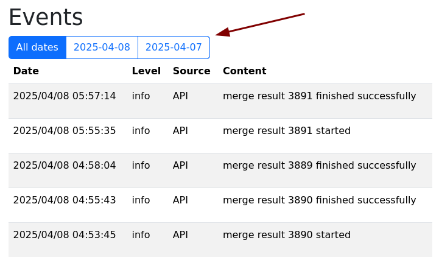{width=721 height=422}
</figure>

This view now also sorts events in reverse chronological order.

### Miscellaneous features

- Analysis view: we now have a little input spinner to show that jobs are currently running for the Data Set [\#411](https://gitlab.desy.de/cfel-sc/amarcord-parent/amarcord-serial/-/issues/411)
- Advanced view: You can now delete single runs ([\#412](https://gitlab.desy.de/cfel-sc/amarcord-parent/amarcord-serial/-/issues/412))
- The run table is now sorted by ID instead of by date (this change was necessary for imports where the date doesn’t matter as much) ([\#419](https://gitlab.desy.de/cfel-sc/amarcord-parent/amarcord-serial/-/issues/419))
- We have a new mechanism to synchronize the client (web site) version and the server version, making explicit reloads unnecessary in the future ([\#420](https://gitlab.desy.de/cfel-sc/amarcord-parent/amarcord-serial/-/issues/420))
- Long text fields, for indexing parameters or geometry, no have a little “Copy to 📋” button to copy to the system clipboard. [\#423](https://gitlab.desy.de/cfel-sc/amarcord-parent/amarcord-serial/-/issues/423)
- Merging now also outputs a log file ([\#437](https://gitlab.desy.de/cfel-sc/amarcord-parent/amarcord-serial/-/issues/437), [\#438](https://gitlab.desy.de/cfel-sc/amarcord-parent/amarcord-serial/-/issues/438))
- Indexing jobs will now output a nicer error message if things go “expectedly” wrong ([\#431](https://gitlab.desy.de/cfel-sc/amarcord-parent/amarcord-serial/-/merge_requests/431))
- Indexing jobs now show the resulting `.stream` file ([\#444](https://gitlab.desy.de/cfel-sc/amarcord-parent/amarcord-serial/-/issues/444))
- API: When creating (or updating) a run, you can instruct it to create a Data Set for the run as well ([\#457](https://gitlab.desy.de/cfel-sc/amarcord-parent/amarcord-serial/-/issues/457))
- API: You can now create a finished indexing result ([\#458](https://gitlab.desy.de/cfel-sc/amarcord-parent/amarcord-serial/-/issues/458))

## Fixes

- The indexing daemon now doesn’t start more than ’n’ parallel indexing jobs (in the case of Maxwell, we set it to 3) to prevent a deadlock between primary and secondary jobs ([\#395](https://gitlab.desy.de/cfel-sc/amarcord-parent/amarcord-serial/-/issues/395))
- The analysis view includes a special case for beam times which have exactly one data set, in which case nothing was shown previously and no filters could be applied ([\#399](https://gitlab.desy.de/cfel-sc/amarcord-parent/amarcord-serial/-/issues/399)).
- When adding experiment types, the chemical Attributi were also displayed (although you can only use run Attributi for ETs) ([\#405](https://gitlab.desy.de/cfel-sc/amarcord-parent/amarcord-serial/-/issues/405)).
- If millepede cannot create a detector geometry (because it crashed due to long runs, for example), we don’t store a non-existant geometry file in the DB anymore ([\#409](https://gitlab.desy.de/cfel-sc/amarcord-parent/amarcord-serial/-/issues/409))
- The histogram axes β and γ were labeled incorrectly ([\#417](https://gitlab.desy.de/cfel-sc/amarcord-parent/amarcord-serial/-/issues/417))
- Under certain circumstances (failed indexing results), the data set view omitted merge results entirely ([\#421](https://gitlab.desy.de/cfel-sc/amarcord-parent/amarcord-serial/-/issues/421))
- When specifying a geometry file, white-space wasn’t stripped from the input field, creating unnecessary error conditions ([\#422](https://gitlab.desy.de/cfel-sc/amarcord-parent/amarcord-serial/-/issues/422))
- The indexing-specific call to `list_events` used to fail because of some problems with temporary files. ([\#436](https://gitlab.desy.de/cfel-sc/amarcord-parent/amarcord-serial/-/issues/436), [\#441](https://gitlab.desy.de/cfel-sc/amarcord-parent/amarcord-serial/-/issues/441))
- Editing the indexing command-line previously just added and changed options, and didn’t remove any ([\#447](https://gitlab.desy.de/cfel-sc/amarcord-parent/amarcord-serial/-/issues/447))
- Runs API: you can now add new files to an existing run ([\#450](https://gitlab.desy.de/cfel-sc/amarcord-parent/amarcord-serial/-/issues/450))
- Indexing UI: added missing CrystFEL indexamajig parameters `--highres` and `--max-mille-level` ([\#459](https://gitlab.desy.de/cfel-sc/amarcord-parent/amarcord-serial/-/issues/459))

## Development changes

- We now use [uv](https://docs.astral.sh/uv/) instead of poetry for dependency management, as well as [uv2nix](https://github.com/pyproject-nix/uv2nix) for Nix integration ([\#393](https://gitlab.desy.de/cfel-sc/amarcord-parent/amarcord-serial/-/issues/393))
- The nixpkgs version was upgraded to 24.11, which is stable now ([\#397](https://gitlab.desy.de/cfel-sc/amarcord-parent/amarcord-serial/-/issues/397))
- `isort` and `pylint` were replaced by [ruff](https://docs.astral.sh/ruff/) ([\#401](https://gitlab.desy.de/cfel-sc/amarcord-parent/amarcord-serial/-/issues/401))

# v1.1 - after beamtime at P11 with the Tape Drive in October 2024

## Features

- Completely new, feature-rich analysis view (#390, #377, #376)
- MTZ download file names are now readable, instead of hashes (#386)
- In the Runs Table, the "Edit" button is now on the very left (#382)
- When merging, you can now restrict to a randomly selected number of crystals (#380)
- In the Run Analysis, you can now change the display for the detector shift graph (#372)

## Fixes

- The indexing rate is now based on the number of frames, instead of the number of hits everywhere (#374)
- The "Current user" input in the event log is now properly time-zoned (#371)
