If this document renders weirdly, it’s because it uses [GitLab flavored markdown](https://docs.gitlab.com/user/markdown/#table-of-contents) and some elements might not be supported by your viewer.

[TOC]
# 🚧 v1.5 - Q2 2026

## Features

### Merging: Add "custom split" option
([\#486](https://gitlab.desy.de/amarcord/amarcord/-/issues/486))

CrystFEL's `partialator` has the ability to split a processed `.stream` file into distinct datasets. The most common use-case are pump-probe experiments where you have a sample in different states after some excitation. Think: one image is not excited, the next one is excited, then again not excited, and so on. When you merge a dataset, you can now specify a comma-separated list of datasets to split the merge result into, and this will be passed on to `partialator`. The result will be 'n+1' merge results, each with its own "dataset" property (+1 because the base merge result is included).

<figure>
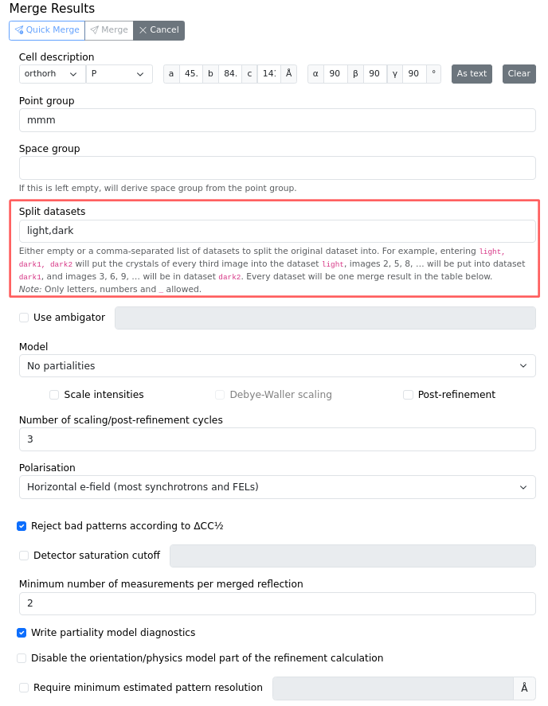{width=388 height=500px}
<figcaption>Highlighted is the new section in the "Merge" pop-up.</figcaption>
</figure>

<figure>
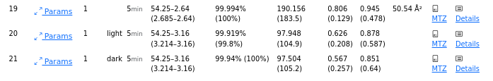{width=697 height=115px}
<figcaption>Three merged datasets for the given input.</figcaption>
</figure>

## Miscellaneous things

- *Indexing methods* in the "Start indexing job" UI are now just "on/off" instead of "on/off", plus "prior lattice information" and "prior unit cell information". CrystFEL abolished the syntax in the latest release, and AMARCORD follows suit ([\#484](https://gitlab.desy.de/amarcord/amarcord/-/issues/484))
- Single data set: If there are runs without successful indexing results, there was already a checkbox indicating that. However, it was so subtle that it's extremely hard to miss. As you can see below, this is now better:
<figure>
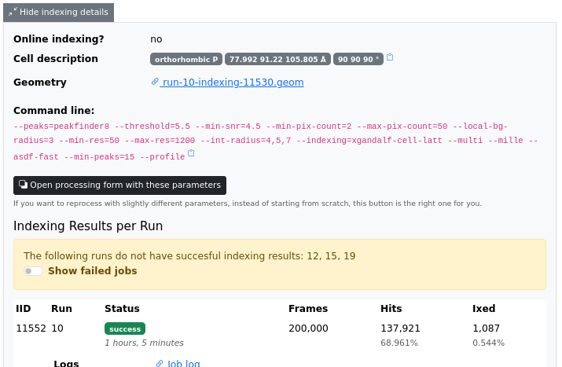{width=715 height=467px}
<figcaption>Hard to miss failed jobs now, isn't it?</figcaption>
</figure>
- Repeated error messages in the *ID29 daemons* are now only output once ([\#492](https://gitlab.desy.de/amarcord/amarcord/-/issues/492))
- In the *single data set* view, we now show the number of indexing jobs still running ([\#500](https://gitlab.desy.de/amarcord/amarcord/-/issues/500))

## Fixes

- The MJPEG camera daemon didn't have a beamline filter, meaning every active beamtime triggered the camera image to be taken.  ([\#445](https://gitlab.desy.de/amarcord/amarcord/-/issues/494))
- In the *ID29 pull daemon* we now ignore local stream files ([\#499](https://gitlab.desy.de/amarcord/amarcord/-/issues/499))

## Development changes

- The pytest tests are now parallelized, they were simply taking too long ([\#501](https://gitlab.desy.de/amarcord/amarcord/-/issues/501))

# v1.4 - Q1 2026

## Features

### Geometries as first-class citizens ([\#445](https://gitlab.desy.de/amarcord/amarcord/-/issues/445))

Previously, CrystFEL geometry content was not not stored in the database. Instead, we stored a *path* to a geometry file, as well as a *hash* of the contents, so we could do an "is same" check on geometries safely and thus compare indexing parameters.

This worked, but not having the geometry inside the database meant we couldn't *synthesize* geometry files for ourselves. However, one of the advantages of a central database system is that it logs parameters such as the detector distance and the X-ray energy, and it would be nice if we could "copy" that to the geometry.

So now, geometry files are a first-class citizen, meaning you can create, update, inspect and delete geometries from AMARCORD's user interface. And of course, use geometries in your CrystFEL indexing jobs. Also, geometries can have *placeholders* for Run Attributi, so you can insert the run's detector distance directly into the geometry. See the new "user guide" for more information.

<figure>
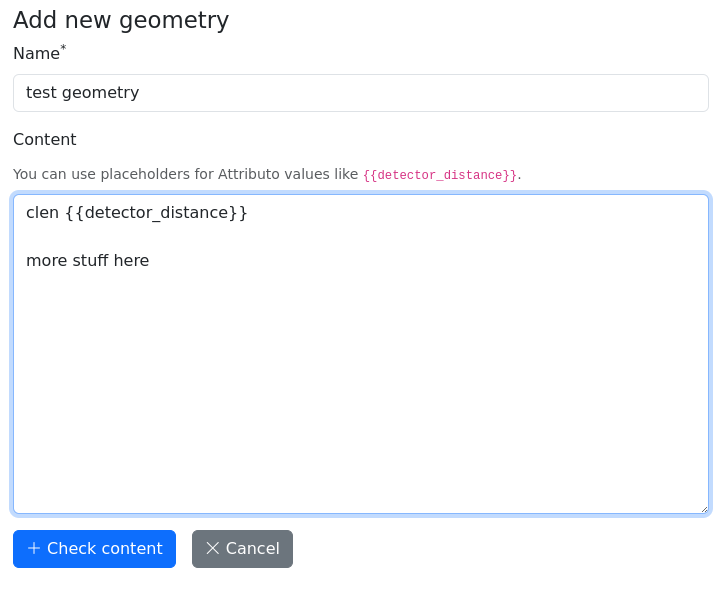{width=622 height=510px}
<figcaption>The "Add new geometry" form, showing (off) a `detector_distance` placeholder.</figcaption>
</figure>

### Chemicals: Better "Copy from previous beamtime" input ([\#478](https://gitlab.desy.de/amarcord/amarcord/-/issues/478))

Since the list of chemicals across beamtimes keeps growing, and most of the time you actually know which chemical to copy (by name), you can now just click the drop-down and start typing!

<figure>
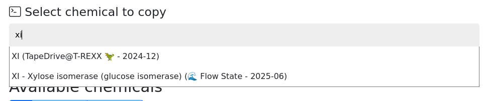{width=971 height=202px}
<figcaption>Searching for the string "XI" yields the necessary results. Imaging scrolling down a few kilometers instead!</figcaption>
</figure>

### Miscellaneous things

- When uploading a file in "Chemicals" (when adding or editing a chemical), you don't have to type in a description for the file. It will be automatically filled with the file name.
- Updated to NixOS 25.11, Python 3.13 and updated all Python dependencies (see [GitLab MR 477](https://gitlab.desy.de/amarcord/amarcord/-/merge_requests/477))
- If you have beamtime at ID29, you can now use two new AMARCORD daemons top pull data into the DESY filesystem and process it there (see [GitLab MR 441](https://gitlab.desy.de/amarcord/amarcord/-/merge_requests/441))
- The "beamtime overview" page has been reworked a bit to include the chemicals directly, and the table is now more "vertical", less "horizontal" ([\#489](https://gitlab.desy.de/amarcord/amarcord/-/issues/489))
- Filesystem paths are now broken with the `wbr` HTML tag, allowing the browser to layout stuff a little more easily ([\#491](https://gitlab.desy.de/amarcord/amarcord/-/issues/491))
- The run-based analysis view, as well as the "Current Run" view now show the number of indexed frames in the run, not just the overall ([\#491](https://gitlab.desy.de/amarcord/amarcord/-/issues/491))
- Show the indexing result with the most indexed frames in the overview ([GitLab MR 488](https://gitlab.desy.de/amarcord/amarcord/-/merge_requests/488))

## Fixes

- The number of indexed frames in the run overview was referring to the maximum number of indexed frames in *any* indexing result, not just the online result. This is highly confusing and was changed ([\#481](https://gitlab.desy.de/amarcord/amarcord/-/issues/481))
- The indexing daemon didn't tell apart online and offline indexing jobs, so too many offline jobs were able to block online jobs from starting ([\#480](https://gitlab.desy.de/amarcord/amarcord/-/issues/480))
- SLURM at DESY changed a bit, and we're now using a different HTTP REST interface endpoint to access it ([\#482](https://gitlab.desy.de/amarcord/amarcord/-/issues/482))
- The indexing details used to show changes in the cell description when really, there were none ([\#483](https://gitlab.desy.de/amarcord/amarcord/-/issues/483))
- The indexing daemon sometimes labeled jobs that are still running as failed ([\#485](https://gitlab.desy.de/amarcord/amarcord/-/issues/485))
- Offline indexing jobs and online ones used different output directories. Offline results were in `$output_path/indexing-results` whereas online ones were simply in `$output_path`. ([\#488](https://gitlab.desy.de/amarcord/amarcord/-/issues/488))
- When specifying a SLURM REST workload manager, you can omit the partition now (if you have a reservation for, example) ([GitLab MR 484](https://gitlab.desy.de/amarcord/amarcord/-/merge_requests/484))
- When millepede fails to give a proper new geometry in _online_ indexing, don't make the whole job fail ([\#490](https://gitlab.desy.de/amarcord/amarcord/-/issues/490))

## Development changes

- The AMARCORD docker image now contains all of the Python scripts (like the migration script) instead of just the web server starter ([\!478](https://gitlab.desy.de/amarcord/amarcord/-/merge_requests/478))

# v1.3 - Q2 2025

## Features

### Indexing: New geometry refinement parameters ([\#472](https://gitlab.desy.de/amarcord/amarcord/-/issues/472))

Since 0.12.0, CrystFEL supports refining the Z shift (i.e. the camera length), and also panel rotations and tilts. AMARCORD will call `align_detector` with the accompanying parameters and parse its output, storing the result in the database.

<figure>
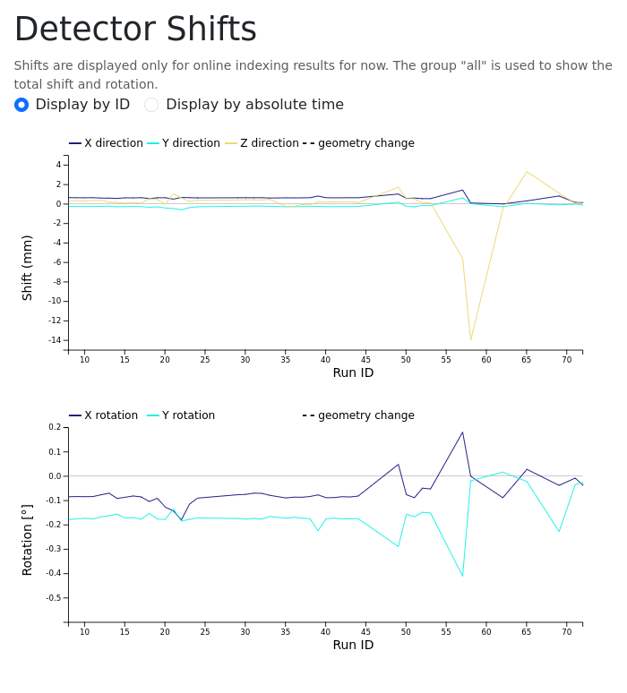{width=465 height=510px}
<figcaption>The adapted "Geometry" page showing a beamtime's worth of runs and detector shifts and rotations. There were no geometry changes in this beam time.</figcaption>
</figure>

Note that the page "Analysis → By Run" has been split into "Analysis → Geometry" and "Analysis → By Run".

### Merging: Cutoffs ([\#469](https://gitlab.desy.de/amarcord/amarcord/-/issues/469))

When merging, instead of just calling CrystFEL's `get_hkl` without any user input, you can now specify resolution cutoffs which are passed down to `get_hkl` in the end. For the high resolution cutoff, you can even specify three different cutoffs in order to do anisotropic cuts:
<figure>
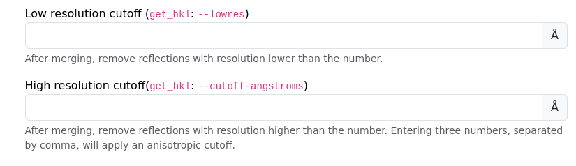{width=825 height=238px}
<figcaption>At the very end of the merge options, you can now set the cutoffs used.</figcaption>
</figure>

### Miscellaneous features

- Indexing: jobs now give more meaningful error messages in case there are files missing for runs. Instead of just `input file list empty - maybe the run has the wrong files entered?`, you now also get `I've searched the following patterns for files:  ...` ([\#462](https://gitlab.desy.de/amarcord/amarcord/-/issues/462))
- Indexing: in a similar vein to the above, you now get a better error message when the geometry file is missing; this previously complained about `cannot resolve geometry hash`, which is true, but unhelpful. Now you see `cannot find the given geometry file ..., check that it exists and is readable`
- Indexing: now, also an error in `list_events` will be reported properly
- SLURM REST interface: you now need to explicitly specify an `api-version` parameter (since the version changes frequently and it shouldn't be hard-coded) ([\#467](https://gitlab.desy.de/amarcord/amarcord/-/merge_requests/455))
- Indexing results: failed results are now hidden, and can be shown with a check-box ([\#468](https://gitlab.desy.de/amarcord/amarcord/-/issues/468))
- Files are now compressed if they are too big. There is a parameter in the API to force this on or off, too ([\#429](https://gitlab.desy.de/amarcord/amarcord/-/issues/429)). Nothing changes for the normal user.
- The "All runs" table now has a date columns for "started" and "stopped". Previously we only displayed the time, which was useless in multi-day beamtimes ([\#466](https://gitlab.desy.de/amarcord/amarcord/-/issues/466)):
<figure>
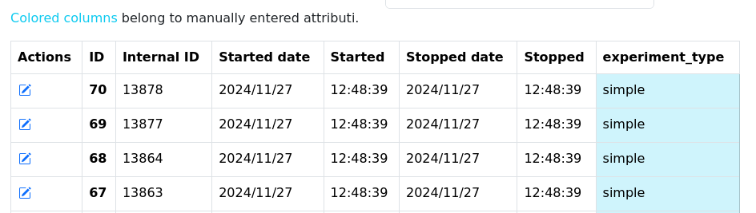{width=944 height=267px}
</figure>

## Fixes

- Run Overview: The browser tab title now changes even if the tab is in the background ([\#460](https://gitlab.desy.de/amarcord/amarcord/-/issues/460))
- Merging: Error output from partialator was omitted from job log ([\#461](https://gitlab.desy.de/amarcord/amarcord/-/issues/461))
- Export: Fixed error message if there were chemicals with files in it.

## Development changes

- Upgraded the pydantic serialization/deserialization framework to version 2 now, resulting in increased performance ([\#463](https://gitlab.desy.de/amarcord/amarcord/-/issues/463))
- Remove `python-dateutil` and `pytz`, both superseded by Python 3.9's [ZoneInfo](https://docs.python.org/3.9/library/zoneinfo.html) (and `python-dateutil` had a Python 3.12 [deprecation warning](https://github.com/dateutil/dateutil/issues/1284)). In the light of that, rework all of the frontend and backend to have a consistent time zone usage. This doesn't affect the user and is documented in the official documentation. ([\#465](https://gitlab.desy.de/amarcord/amarcord/-/issues/465))

# v1.2 - Q1 2025

## Features
### Excel import ([\#249](https://gitlab.desy.de/amarcord/amarcord/-/issues/249), [\#406](https://gitlab.desy.de/amarcord/amarcord/-/issues/406), [\#407](https://gitlab.desy.de/amarcord/amarcord/-/issues/407), [\#410](https://gitlab.desy.de/amarcord/amarcord/-/issues/410), [\#413](https://gitlab.desy.de/amarcord/amarcord/-/issues/413), [\#414](https://gitlab.desy.de/amarcord/amarcord/-/issues/414), [\#415](https://gitlab.desy.de/amarcord/amarcord/-/issues/415), [\#416](https://gitlab.desy.de/amarcord/amarcord/-/issues/416), [\#428](https://gitlab.desy.de/amarcord/amarcord/-/issues/428), [\#440](https://gitlab.desy.de/amarcord/amarcord/-/issues/440), [\#446](https://gitlab.desy.de/amarcord/amarcord/-/issues/446))

It is now possible to import run metadata from an Excel spreadsheet. The feature is available from the menu via “Admin → Import”:

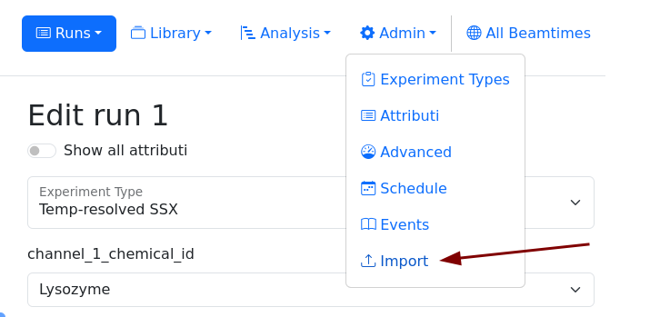{width=726 height=349px}

Via a wizard, you will be guided through the discrete steps in order to import your metadata, from creating Attributi, to Experiment Types, to the runs themselves. You will be able to download a template .xlsx file to fill out.

<figure>
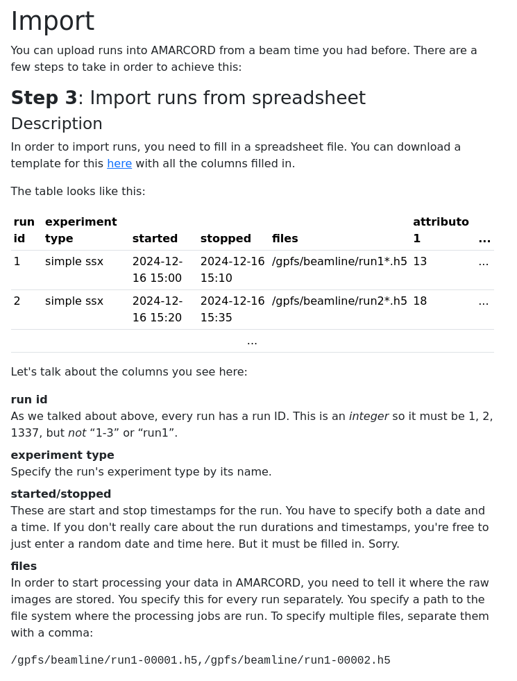{width=388 height=510px}
<figcaption>The last step of the import: actually uploading the Excel file, with a description of the columns needed and possible.</figcaption>
</figure>
<figure>
{width=388 height=510px}
<figcaption>The last step of the import: actually uploading the Excel file, with a description of the columns needed and possible.</figcaption>
</figure>

The import can be _simulated_ first, to see which Data Sets would be generated, and how many runs. There are also a lot of sanity checks in place to guarantee you’re importing something correctly.
### Data Set view: Indexing parameter differences ([\#439](https://gitlab.desy.de/amarcord/amarcord/-/issues/439))

When you’re trying to figure out the best parameters to index your frames, you often play around a lot. Previously, AMARCORD did show you the command-line arguments (as well as the unit cell and geometry file path) for every indexing job _individually_. If you were interested in finding out what _changed_ between results, you were out of luck.

Now, the Data Set view shows which parameters have changed since the previous indexing result:

<figure>
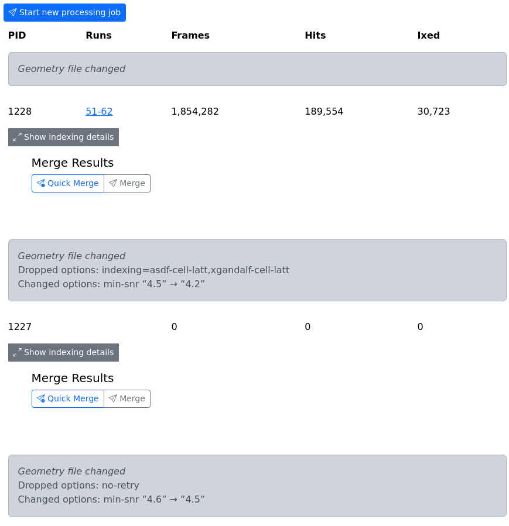{width=493 height=510px}
<figcaption>A Data Set with some indexing results; you can better see what parameters changed now.</figcaption>
</figure>

As you can see, for the geometry file, we only get “changed” for now. In the future we might be more specific.

### Cell description edit interface ([\#431](https://gitlab.desy.de/amarcord/amarcord/-/issues/431),  [\#435](https://gitlab.desy.de/amarcord/amarcord/-/issues/435), [\#452](https://gitlab.desy.de/amarcord/amarcord/-/issues/452))

Editing a unit cell (UC) description was a purely text-based affair previously. You had an input field and had to fill it correctly. There was no feedback on whether what you typed was actually a valid unit cell!

This has changed, and we now have a UI widget that still has the text capabilities (which is nice for copy&pasting a UC) but now also has a view with separate input fields:

<figure>
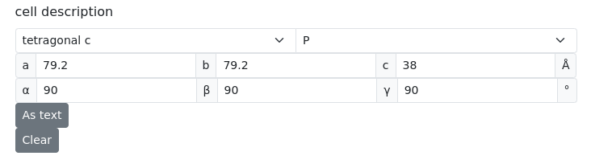{width=732 height=199px}
<figcaption>The “structured” editing view (it will be in one single line if your screen is big enough)</figcaption>
</figure>

This widget also has feedback on validity of UCs, see here:

<figure>
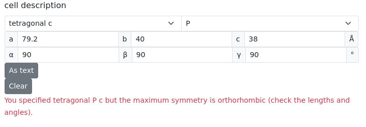{width=719 height=251px}
<figcaption>Entering an “invalid” UC description (b changed to 40, making this not tetragonal)</figcaption>
</figure>

### Special Attributo: “space group” 🪄 ([\#430](https://gitlab.desy.de/amarcord/amarcord/-/issues/430))

You can now create a string Attributo called “space group” for chemicals, which will be used to write the space group into the .mtz file after merging. Previously, the point group was chosen, which was mostly wrong and lead to complications when trying to refine the MTZ file generated by AMARCORD.

You can also specify the space group explicitly when merging.

<figure>
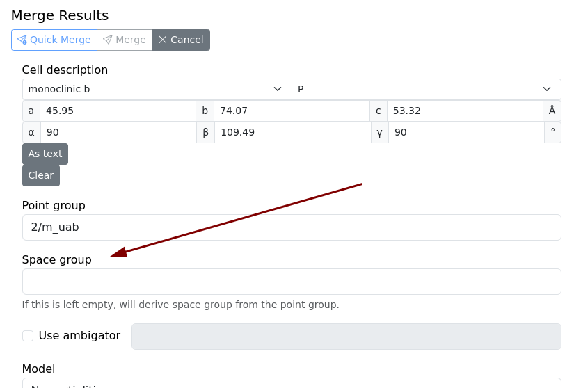{width=755 height=510px}
<figcaption>The merge details show you the space group that will be used for merging and which will be taken from the chemical if entered there.</figcaption>
</figure>

### Attributi edit: Separate into tabs

There are _chemical_ Attributi and _run_ attributi. Previously, they were shown in one table under “Admin → Attributi”. Now this is separated into tabs, hopefully reducing confusion:

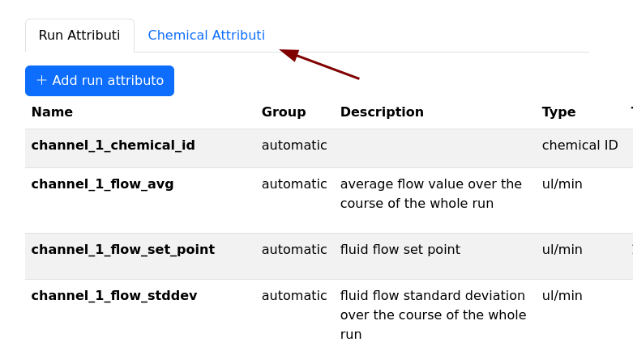{width=781 height=423px}

### Data set view: link to the runs table ([\#408](https://gitlab.desy.de/amarcord/amarcord/-/issues/408))

In the data set view, you can now not only see which runs belong to a data set, but also get a limit runs table for just these runs:

<figure>
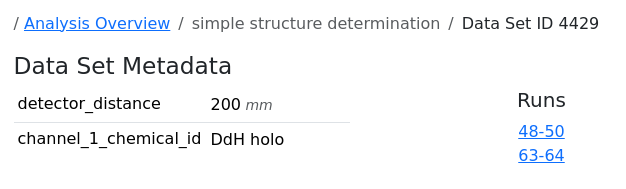{width=626 height=189px}
<figcaption>Excerpt from the Data Set overview, where the runs are actually clickable now, and will filter the runs table with runs 48-50 and 63-64 so you can inspect more details.</figcaption>
</figure>

### Runs: make files editable ([\#403](https://gitlab.desy.de/amarcord/amarcord/-/issues/403))

Runs always had, in addition to storing Attributi, _files_ attached to them (think HDF5 files). These would be used as the basis offline indexing. These files can now be _edited_ in the runs table (press the “Edit run” icon, then scroll down):

<figure>
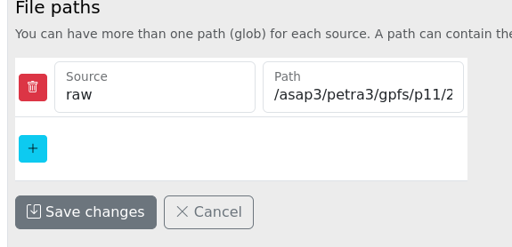{width=575 height=278px}
<figcaption>A little hard to see (hard to make a screenshot that fits on smaller displays), but this is a cropped view of the runs table, while editing a single run. You can see a single file “glob” attached to it, pointing to the HDF5 files for this run.</figcaption>
</figure>

### Beamtimes: Analysis output path ([\#402](https://gitlab.desy.de/amarcord/amarcord/-/issues/402), [\#443](https://gitlab.desy.de/amarcord/amarcord/-/issues/443))

Previously, indexing and merge results were stored at a fixed path, so the experimenter couldn’t decide where to put their files. This is now configurable in the beam time properties:

<figure>
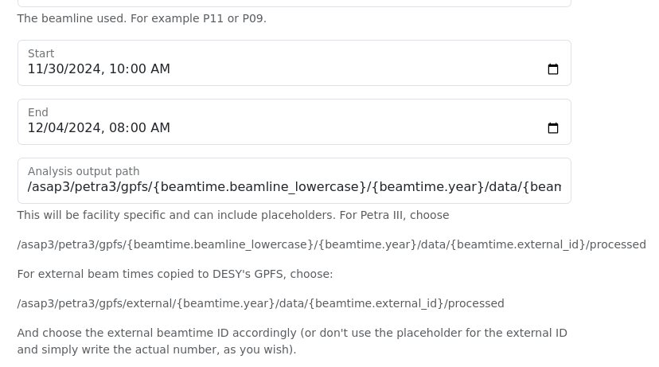{width=828 height=461px}
<figcaption>Cropped view of the “Edit” interface for a single beam time. At the very bottom you can set the output path now.</figcaption>
</figure>

There are placeholders so you don’t have to worry about entering the beamline or the beamtime ID twice.

### Merging: Ambigator support ([\#253](https://gitlab.desy.de/amarcord/amarcord/-/issues/253))

When merging your indexing results into an .mtz file, you can now specify an [ambigator](https://www.desy.de/~twhite/crystfel/manual-ambigator.html) command-line:

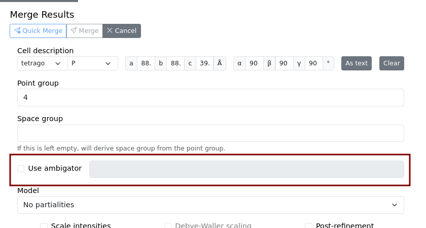{width=840 width=450px}

This currently does not have a nice UI yet, and you cannot pass _all_ ambigator arguments. For simplicity’s sake, only the _long_ arguments are supported. This means you cannot specify `-y point-group` but have to use `--symmetry point-group`.

If you do, then the “Details” view contains the fg-graph plot and can tell you more about the outcome:

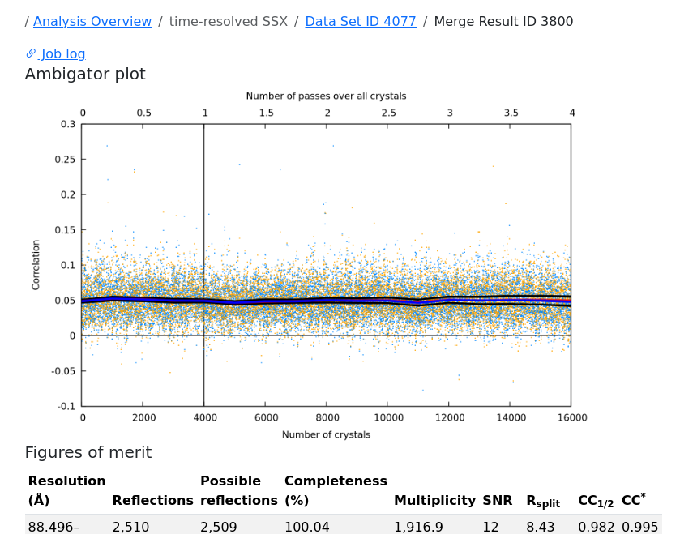{width=650 height=510px}

### Event log: Date filter ([\#456](https://gitlab.desy.de/amarcord/amarcord/-/issues/456))
The under-used “Events” view (accessible via the menu “Admin” → “Event Log”) now has a date filter just like the run table:

<figure>
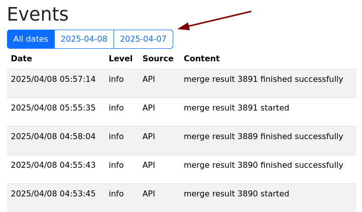{width=721 height=422}
</figure>

This view now also sorts events in reverse chronological order.

### Miscellaneous features

- Analysis view: we now have a little input spinner to show that jobs are currently running for the Data Set [\#411](https://gitlab.desy.de/amarcord/amarcord/-/issues/411)
- Advanced view: You can now delete single runs ([\#412](https://gitlab.desy.de/amarcord/amarcord/-/issues/412))
- The run table is now sorted by ID instead of by date (this change was necessary for imports where the date doesn’t matter as much) ([\#419](https://gitlab.desy.de/amarcord/amarcord/-/issues/419))
- We have a new mechanism to synchronize the client (web site) version and the server version, making explicit reloads unnecessary in the future ([\#420](https://gitlab.desy.de/amarcord/amarcord/-/issues/420))
- Long text fields, for indexing parameters or geometry, no have a little “Copy to 📋” button to copy to the system clipboard. [\#423](https://gitlab.desy.de/amarcord/amarcord/-/issues/423)
- Merging now also outputs a log file ([\#437](https://gitlab.desy.de/amarcord/amarcord/-/issues/437), [\#438](https://gitlab.desy.de/amarcord/amarcord/-/issues/438))
- Indexing jobs will now output a nicer error message if things go “expectedly” wrong ([\#431](https://gitlab.desy.de/amarcord/amarcord/-/merge_requests/431))
- Indexing jobs now show the resulting `.stream` file ([\#444](https://gitlab.desy.de/amarcord/amarcord/-/issues/444))
- API: When creating (or updating) a run, you can instruct it to create a Data Set for the run as well ([\#457](https://gitlab.desy.de/amarcord/amarcord/-/issues/457))
- API: You can now create a finished indexing result ([\#458](https://gitlab.desy.de/amarcord/amarcord/-/issues/458))

## Fixes

- The indexing daemon now doesn’t start more than ’n’ parallel indexing jobs (in the case of Maxwell, we set it to 3) to prevent a deadlock between primary and secondary jobs ([\#395](https://gitlab.desy.de/amarcord/amarcord/-/issues/395))
- The analysis view includes a special case for beam times which have exactly one data set, in which case nothing was shown previously and no filters could be applied ([\#399](https://gitlab.desy.de/amarcord/amarcord/-/issues/399)).
- When adding experiment types, the chemical Attributi were also displayed (although you can only use run Attributi for ETs) ([\#405](https://gitlab.desy.de/amarcord/amarcord/-/issues/405)).
- If millepede cannot create a detector geometry (because it crashed due to long runs, for example), we don’t store a non-existant geometry file in the DB anymore ([\#409](https://gitlab.desy.de/amarcord/amarcord/-/issues/409))
- The histogram axes β and γ were labeled incorrectly ([\#417](https://gitlab.desy.de/amarcord/amarcord/-/issues/417))
- Under certain circumstances (failed indexing results), the data set view omitted merge results entirely ([\#421](https://gitlab.desy.de/amarcord/amarcord/-/issues/421))
- When specifying a geometry file, white-space wasn’t stripped from the input field, creating unnecessary error conditions ([\#422](https://gitlab.desy.de/amarcord/amarcord/-/issues/422))
- The indexing-specific call to `list_events` used to fail because of some problems with temporary files. ([\#436](https://gitlab.desy.de/amarcord/amarcord/-/issues/436), [\#441](https://gitlab.desy.de/amarcord/amarcord/-/issues/441))
- Editing the indexing command-line previously just added and changed options, and didn’t remove any ([\#447](https://gitlab.desy.de/amarcord/amarcord/-/issues/447))
- Runs API: you can now add new files to an existing run ([\#450](https://gitlab.desy.de/amarcord/amarcord/-/issues/450))
- Indexing UI: added missing CrystFEL indexamajig parameters `--highres` and `--max-mille-level` ([\#459](https://gitlab.desy.de/amarcord/amarcord/-/issues/459))

## Development changes

- We now use [uv](https://docs.astral.sh/uv/) instead of poetry for dependency management, as well as [uv2nix](https://github.com/pyproject-nix/uv2nix) for Nix integration ([\#393](https://gitlab.desy.de/amarcord/amarcord/-/issues/393))
- The nixpkgs version was upgraded to 24.11, which is stable now ([\#397](https://gitlab.desy.de/amarcord/amarcord/-/issues/397))
- `isort` and `pylint` were replaced by [ruff](https://docs.astral.sh/ruff/) ([\#401](https://gitlab.desy.de/amarcord/amarcord/-/issues/401))

# v1.1 - after beamtime at P11 with the Tape Drive in October 2024

## Features

- Completely new, feature-rich analysis view (#390, #377, #376)
- MTZ download file names are now readable, instead of hashes (#386)
- In the Runs Table, the "Edit" button is now on the very left (#382)
- When merging, you can now restrict to a randomly selected number of crystals (#380)
- In the Run Analysis, you can now change the display for the detector shift graph (#372)

## Fixes

- The indexing rate is now based on the number of frames, instead of the number of hits everywhere (#374)
- The "Current user" input in the event log is now properly time-zoned (#371)
