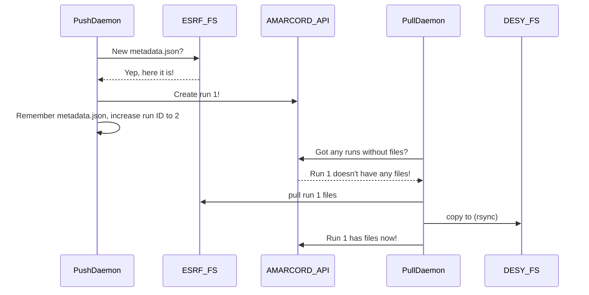

# Setups at facilities

(DESYSetup)=
## DESY

`cfeld-vm04` has a MySQL instance, running on the non-standard port 3307. This is the main test system whenever you need to test something in the "DESY infrastructure", meaning checking if ports are available, and communication between DESY's Maxwell system and the VMs.

`cfeld-vm04` also has an AMARCORD UI instance running for the MySQL DB: http://cfeld-vm04:6020/index.html. It is run via Docker and the accompanying script is stored in `/root/docker-scripts/run-cfelsx-with-mysql-on-cfeld-vm04.sh`.

(ID29)=
## ID29 at ESRF

**Note**: Everything described here is currently in the `id29` branch and is not merged yet.

To ingest beamtimes from ESRF, be that live or after the fact, we have two processes: the *pull* daemon and the *push* daemon.

The **push daemon** runs on an ESRF machine (connect via `ssh -p 5022 -l $username firewall.esrf.fr`) and is located in `amarcord.cli.id29_push_daemon`. Its role is to check the beamtime folder for `metadata.json` files and to then ingest the metadata into AMARCORD via its public API. Here's a sequence diagram on how the daemons work:



The push daemon gets a beamtime ID and operates on that beamtime alone, so the beamtime has to be created beforehand. Here's a sample command-line:

```
MY_BASE=$HOME/id29-data

python amarcord/cli/id29_push_daemon.py \
       --amarcord-beamtime-id 1337\
       --amarcord-url 'https://amarcord.de\
       --raw-data-path "/data/visitor/$proposal/id29/$date" \
       --run-id-file "$MY_BASE/run-id.txt"\
       --metadata-visited-file "$MY_BASE/metadata-visited.txt"\
       --attributo-config-file "$MY_BASE/attributo-config.json"\
       --geometry-save-path "/data/visitor/$proposal/id29/$date/PROCESSED_DATA/$(whoami)/geometries"\
       --stream-visited-file "$MY_BASE/stream-visited.txt"\
       --amarcord-user $user\
       --amarcord-password $pw\
       --sample-attributo "sample"\
       --tag-attributo "tag"
```

As you can see, there's quite a lot of parameters to give. Most of them hopefully self-explanatory:

- The `run-id-file` is a file that the daemon itself generates and updates. It contains the latest run ID in AMARCORD. ID29, as far as we can tell, doesn't have the concept of a numeric, monotonically increasing run ID, so we have to synthesize it.
- The `metadata-visited-file` is also created and updated by the daemon; it stores which `metadata.json` files the daemon has already processed. Similar for `stream-visited-file`.
- The daemon also gets an `attributo-config-file` which tells it which attributes are to be expected in the `metadata.json` and how to map these to AMARCORD attributi. Currently, there are three special attributi: `sample` (which maps to a real chemical name in AMARCORD), `tag` (which maps to the path segment that ESRF uses to identify runs), and `MX_directory`, which is used by the pull daemon (see below).
- `geometry-save-path` is where the geometry files which are extracted from the finished `.stream` files are copied to, so they can be referenced in the indexing results

An example `attributo-config.json` looks like this:

```json
[
    {"beamline-name": "MX_beamSizeAtSampleX", "attributo-name": "MX_beamSizeAtSampleX", "attributo-type": "number"},
    {"beamline-name": "MX_beamSizeAtSampleY", "attributo-name": "MX_beamSizeAtSampleY", "attributo-type": "number"},
    {"beamline-name": "MX_detectorDistance", "attributo-name": "MX_detectorDistance", "attributo-type": "number"},
    {"beamline-name": "MX_directory", "attributo-name": "MX_directory", "attributo-type": "string"},
    {"beamline-name": "MX_exposureTime", "attributo-name": "MX_exposureTime", "attributo-type": "number"},
    {"beamline-name": "MX_numberOfImages", "attributo-name": "MX_numberOfImages", "attributo-type": "integer"},
    {"beamline-name": "MX_transmission", "attributo-name": "MX_transmission", "attributo-type": "number"},
    {"beamline-name": "MX_wavelength", "attributo-name": "MX_wavelength", "attributo-type": "number"}
]
```

The *pull daemon* - located at `amarcord.cli.id29_push_daemon` - is a little simpler: it gets the files for a run by looking at the `MX_directory` attribute. It has a rewrite rule to map this directory to a DESY-local one, and then calls `rsync` to copy the data. Here's an example command line:

```
python amarcord/cli/id29_pull_daemon.py\
       --sshpass-path "$HOME/local/bin/sshpass"\
       --db-connection-url "..."\
       --copy-raw-data\
       --path-prefix "/data/visitor/$proposal/id29/$date"\
       --path-prefix-replacement "/asap3/petra3/gpfs/external/$year/data/$external_id/processed/$date"\
       --geom-path-prefix "/data/visitor/$proposal/id29/$date/PROCESSED_DATA/$(whoami)/geometries/"\
       --geom-path-prefix-replacement "/asap3/petra3/gpfs/external/$year/data/$proposal/processed/$date/PROCESSED_DATA/$(whoami)/geometries"\
       --amarcord-beamtime-id 1337\
       --directory-attributo-name "MX_directory"\
       --dont-copy-attributo-name "do not copy"\
       --esrf-ssh-host dt.esrf.fr\
       --esrf-user philipp1987a\
       --esrf-password '$esrf_pw'
```

For the daemon to work without user-interaction, we have to give `rsync` a password in advance. For that, we employ `sshpass`. You might have this installed in `$PATH` already, but otherwise, give its location in `sshpass-path`. We will use `esrf-user` and `esrf-password` for the `sshpass` call then.

The daemon uses the database directly, instead of the AMARCORD API, which is why this daemon gets a `db-connection-url` instead of a HTTP URL.

Since its job is to get the data from the ESRF file system and copy it to the local one, we need a replacement rule: how do we get from path $remote to path $local? In the daemon, we simply text-replace. A path like:

```
/data/visitor/$proposal/id29/$date/PROCESSED_DATA/$(whoami)/geometries/foo.geom
```

will be replaced via the given `geom-path-prefix` to `geom-path-prefix-replacement`:

```
/asap3/petra3/gpfs/external/$year/data/$proposal/processed/$date/PROCESSED_DATA/$(whoami)/geometries
```

Same goes for the `path-prefix` (for the actual raw files) and `path-prefix-replacement`.
