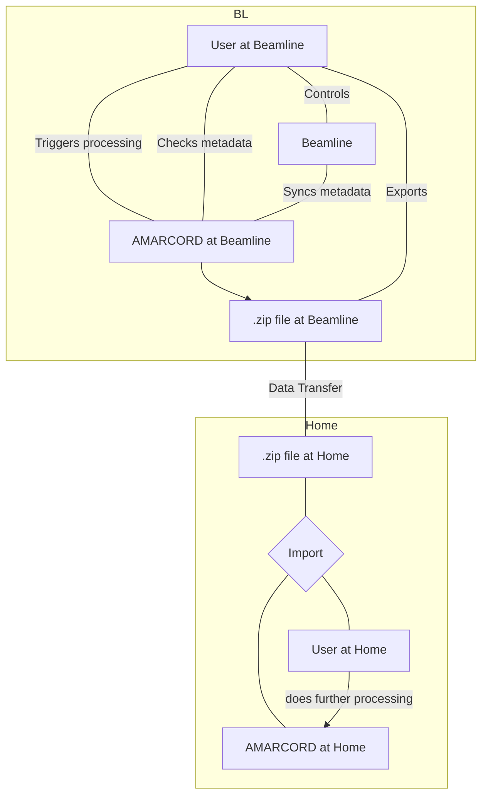

# 🧑‍🔬 User Guide

(UserGuide)=
## Introduction

This document will assume you're not a programmer, but a regular user of AMARCORD.

(UserImport)=
## Import and Export

### Rationale
There are two ways to import and export beamtimes in AMARCORD: via an Excel spreadsheet, and via a zip file. For administrative notes on this, go do [the admin guide section on this](AdminImport). For developer's notes no this, go to [the developer guide section on this](DeveloperImport).

The Excel spreadsheet *export* is easy to explain: The use case is to export a beam time so you can look at the data a later point in time with standard tools, such as LibreOffice. It's not meant to be processed further.

The Excel spreadsheet *import* is also easy to explain: You had a beamtime somewhere else and want to now make AMARCORD aware of the metadata, and possibly use it to start jobs to process the data. Note that the Excel import is in a "pre-deprecated" state, meaning it will be replaced by something much more flexible and powerful in the future. This is why we will not explain it further.

The other way to import and export beamtimes is into and from .zip files. Here, the goal is a different one. The idea with this is really to use AMARCORD at the beamline, ingesting beamline data either in the end or even while it is still going on (this is currently implemented for the ID29 beamline, see [](ID29) for more information). Then, after completion of the beamtime, you export your data to a .zip file, take this home with you (or transfer it via the internet to your home institution or a hard drive) and *import* this .zip file into *your* AMARCORD.

The following diagram explains this:



### Export

Exporting a single beamtime can be done in the top-right menu when you click on "Advanced" and then "Export". The site should be self-explanatory, but note that since exporting takes a long time, this is broken down into three steps:

1. Queueing an export job
2. Waiting
3. Downloading the resulting .zip file

You can also decide whether you want to export with CrystFEL .stream files or without. This depends on your available storage space on the one hand, and what you want to do with the resulting data. .stream files can get extraordinarily large (in the order of TiB), and although they are stored in a (bzip2) compressed form, they will still be in the same order of magnitude. If you have the space, and you have the patience to transfer the data, you can choose to do an export with stream files included. The advantage: you can merge your data after the fact, with different parameters.

If you choose against .stream files, you will still get *some* data: the MTZ and PDB files are stored in the database itself, so these will be preserved.

Exporting can also be done from the **command-line**. There is the `amarcord-export-db` executable with options that mirror the options in the GUI. The advantage is that you do not need a browser and can do this from an SSH session to the foreign institute, for example.

### Import

Importing can be found outside of a beamtime, since it is precisely *creating* a new beam time, from a .zip file. In the beamtime overview, on the top, you can see a button "Import beamtime". Pressing this leads you to the import form, which should be mostly self-explanatory. Note that in contrast to exporting, importing is done in a single step. This is for technical reasons, and it means that you have to **keep your browser open** during the whole process — unfortunately.

Select your zip file, and decide whether you want to change the title of the beamtime after you import, or whether to keep it. You can also change the analysis output path.

Import can also be done from the **command-line**. There is the `amarcord-import-db` executable with options that mirror the options in the GUI. There are actually two ways to call this program: 

1. With an existing .zip file, as in the GUI case (in which case you need to specify the stream file output directory and the database URL of the target database).
2. With an existing *database*. This is meant for copying from one database into another, and is the basis for the zip export as well: We copy the source database into an SQLite database, and put the resulting database file along with the stream files into a .zip file. Note that in this mode, currently, stream files are not exported.

In both cases you need to specify at least one database (the source) with a DB url. The syntax of which is described [here](https://docs.sqlalchemy.org/en/20/core/engines.html#database-urls). Typically this will be something like `sqlite+aiosqlite:////path/to/file` (yes, that's *four* slashes).
## Analysis
### Merging

After indexing has completed, you are ready to *merge* the results, going from `.stream` files to `.mtz` files (or `.hkl` files, if you prefer that).

For every indexing parameter combination, you will have one "Quick merge" and one "Merge" button in the analysis view. 

Pressing *Quick merge* will trigger a merge job that has some sensible default values, so that merging will swiftly exit with a first estimate. Depending on your input dataset and machine specifications, even a quick merge might take hours, of course. There is no guarantee.

Pressing *Merge* will open a section with all possible merge options. This is quite overwhelming, so please consult the CrystFEL documentation for more information. Press *Start Merge* to queue the job and observe the result below.

## Geometries

### Intro

To run indexing jobs, you need to provide a *geometry*, which defines *where* the detector is and how the detector pixels are *located* in relation to each other. Geometries are objects in AMARCORD that can be created, updated, deleted and simply enumerated in the user interface in the menu under "Library → Geometries".

### Managing geometries

```{figure} menu-libraries.png

How to get to the overview
```

What you see is a list of currently available geometries:

```{figure} geometry-overview.png
Overview of all geometries (just one) of a sample beamtime.
```

Just as with chemicals, you can add a new geometry from scratch or copy one from a prior beam time. Below that is a list of all current geometries.

Let's look at what happens when you press "Add geometry". You will see a form such as this:

```{figure} add-geometry.png
Clicking "Add geometry" and entering some data.
```

As you can see, only two things are needed when adding a geometry. First is a name, which *must be unique inside this beam time*, and which will appear in drop-down menus for indexing jobs, as well as for finished indexing results.

Below that is the geometry content. This is simply a long piece of text, corresponding to the [CrystFEL geometry](https://gitlab.desy.de/thomas.white/crystfel/-/blob/master/doc/man/crystfel_geometry.5.md) file format. What you see on the screenshot is, of course, not a complete geometry, although `clen ...` is a directive indicating the *camera length*, sometimes also called detector distance (the distance from the detector to the sample).

Of note here is the ability to use *placeholders* in the geometry content. These placeholders are in the so-called [mustache](https://mustache.github.io/) syntax, which you don't *really* have to learn. Just remember that you can use terms like `{{attributo_name}}` inside the geometry, which will be replaced by the actual attributo value for the run that we are indexing with. If you have a run table like this:

<table>
<tr>
<th>Run ID</th>
<th>Detector Distance</th>
<th>Energy</th>
<th>...</th>
</tr>
<tr>
<td>1</td>
<td>200.0</td>
<td>14.000eV</td>
<td>...</td>
</tr>
<tr>
<td>2</td>
<td>201.0</td>
<td>14.500eV</td>
<td>...</td>
</tr>
<tr>
<td>3</td>
<td>205.0</td>
<td>14.000eV</td>
<td>...</td>
</tr>
</table>

And you start an indexing job with the geometry above, we would get:

```
clen 200.0

more stuff here
```

as the geometry for run 1, for example.

Note that *editing* and *deleting* geometries is only possible if it is not in use in an indexing job. Once it's used, it stays.

### Using geometries

Geometries are needed during indexing, so if you start a new indexing job, you will see a drop-down menu with the available geometries:

```{figure} geometry-selection.png
Upon starting a new indexing job, we're greeted by this drop-down. Note that here, `geometry-v3.geom` is a geometry we uploaded manually, whereas the other ones are *generated* (see below).
```

Just select a geometry and submit the job. It will start an indexing job for each run, and use an adapted geometry for each one.

### Problems with changing Run Attributo later

Let's say we have a few runs:

| Run ID | Detector Distance | Group |
|--------|-------------------|-------|
| 1      | 200               | 1     |
| 2      | 300               | 1     |
| 3      | 400               | 1     |

For simplicity, let's say all these runs are part of a single Data Set (with an Experiment Type that has "Group" as the only column).

Furthermore, we have a template that uses the *Detector Distance*, like this:

```
clen = {{Detector Distance}} mm
...
```

If we now start indexing this data set, we end up with a few objects in the database:

- One *Indexing Parameter* object, containing a link to our aforementioned geometry, with the *Detector Distance* not replaced.
- Three *Indexing Result* objects, referencing the *Indexing Parameter* object just mentioned, and the *Run* that was indexed. This also contains the template replacements, so we end up with these results:

| Indexing ID | Parameter ID | Run ID | Detector Distance | Indexed Frames |
|-------------|--------------|--------|-------------------|----------------|
| 1001        | 101          | 1      | 200               | 50             |
| 1002        | 101          | 2      | 300               | 0              |
| 1003        | 101          | 3      | 400               | 500            |

Notice that indexing result 1002 has no indexed frames. We double-check and see that the *Detector Distance* for this run is wrong. It is supposed to be 200, not 300, so the geometry ends up wrong, leading to these results.

Now we have a problem. We could change run 2's detector distance to 200. But what about indexing result 1002? It's still *relevant* somehow - it might even be part of a merge result, in case we merged indexing ID 1001, 1002, 1003 together (although with 0 indexed frames, it doesn't really play a role).

We have thought about this conundrum and decided to solve this rather radically: if you change the *Detector Distance* in the run (or any attribute from a geometry replacement), you are given an error message, telling you what's wrong about it. You are then given the option of changing the attributo anyways, but this will delete all indexing results and optionally merge results that involve this attributo!

```{figure} delete-dependent.png

Sample of an error message when trying to edit an Attributo that is being used. Below that is the checkbox remedying the situation by deleting said indexing results (and merge results attached!).
```

### Discussion on the templating format

This is only for developers and people interested. We chose mustache as a template format because it was standardized (i.e. it has a language-agnostic spec), and because it has support in both of AMARCORD's programming languages: Elm and Python.
